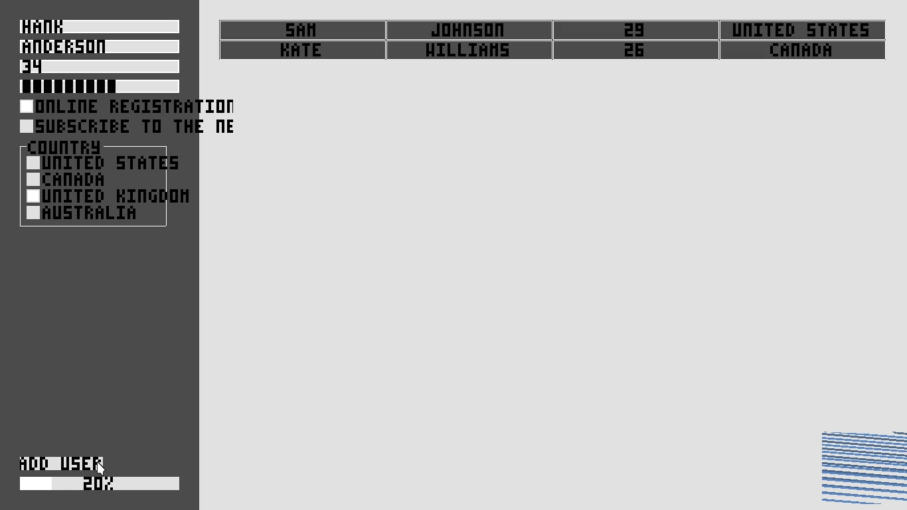
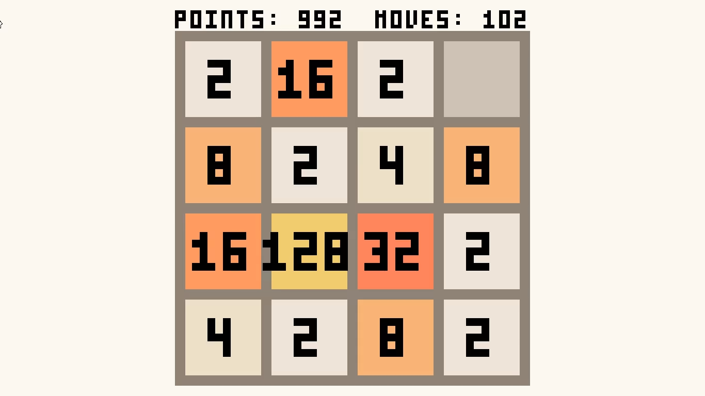
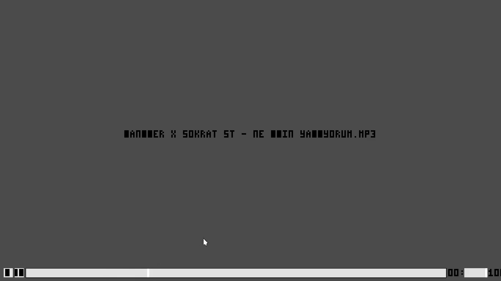
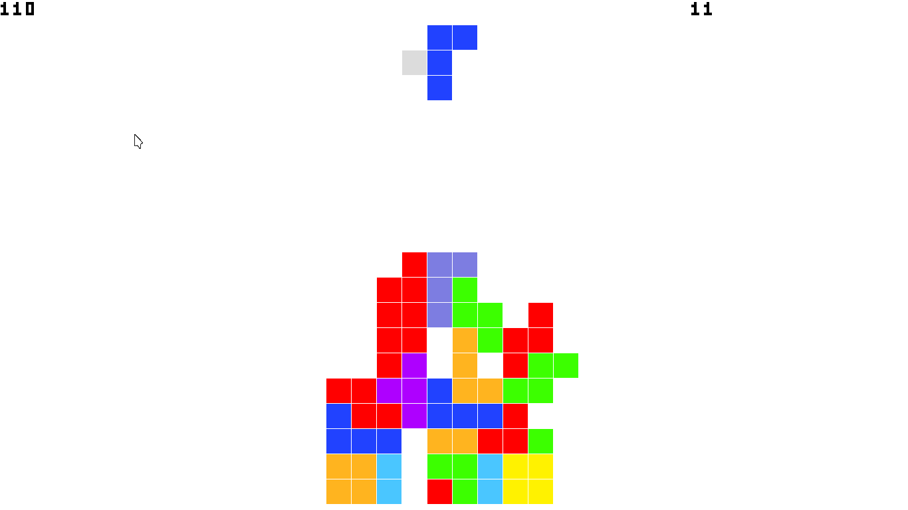

# A framebuffer graphic library

> The library is unstable atm!

* 2D Graphic support (compatible with gg)
* Keyboard support (a little buggy)
* Mouse support

## Support

|                          |                          |
|--------------------------|--------------------------|
|  |      |
|    |    |

* MUI (UI Kit) is supported by [`mfb-backend` branch](https://github.com/malisipi/mui/tree/mfb-backend)
* MUIMPV (The video player widget for MUI) is supported by [`mfb-backend` branch](https://github.com/malisipi/muimpv/tree/mfb-backend). (Requires MUI)
* Most basic gg application can be ported with changing `import gg` with `import malisipi.mfb as gg`. (Also `mfb.context` must be mutable as different than gg to draw.)

## License

* This project was licensed by Apache 2.0 License (`./LICENSE`)
* VPNG module was licensed by MIT License (`./src/vpng`) (The module was edited for making maximum compatibility with the library. The original module is [here](https://github.com/Henrixounez/vpng))
* `./examples/mit` was licensed by MIT License (`./examples/mit`)
* The cursor is licensed by CC-BY-SA-4.0 (Author: phisch (Philipp Schaffrath) on GitHub) (https://github.com/phisch/phinger-cursors/blob/master/assets/svg/32/light/left_ptr.svg) (`./assets/cursor.png`)
